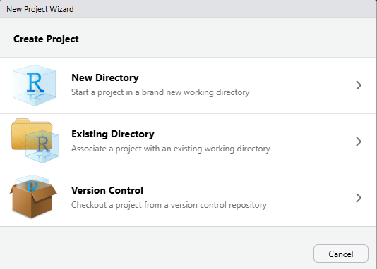
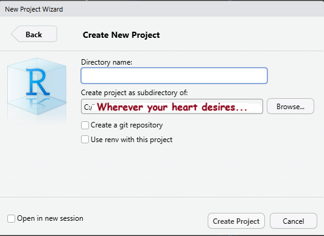
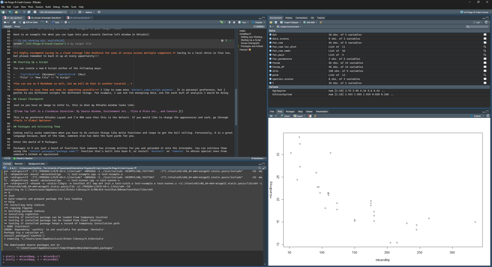

```{r setup, include=FALSE}
knitr::opts_chunk$set(echo = TRUE)
```

# Hello!

First of all, welcome to the R Crash Course. This was designed specifically for UQ SENV International Programs, for those who have not used R before or need a quick refresher.

If you have used R and RStudio throughout your undergraduate degree, you may have absolutely hated it (I know I did). I personally felt that I did not learn it well because it was not taught in a way that was interesting to me. Unfortunately, R is just one of those things that have to be taught in a somewhat generic way to undergrads because everyone has different backgrounds and interests.

I am not too sure what sort of interests you may have but I will try my best to keep these instructional files interesting for you don't feel like offing yourself as you follow along.

If you have any questions/spot any errors, please let me know and I'll rectify them. Good luck!

Marc

# Installing R

So the first thing you'll need to do is install R and RStudio on your laptop/computer.

If you are using a computer that belongs to UQ, there should be an application called Software Centre that can be found by using the search bar in your taskbar. There are some pretty cool software that you can install in said computer, but the one you'll want to look for is called "R (version number) with RStudio (version number) ...".

Do note that, sometimes, UQ computer may already come with R and Rstudio installed, so do poke around before installing.

If you are installing R and RStudio on your **personal computer**, visit:

1.  <https://cran.r-project.org/> (R)
2.  <https://posit.co/downloads/> (RStudio)

**Do note that R and RStudio are 2 different things.**

R is the programming software/language that actually processes your stats, etc., while RStudio is what we call an Integrated Development Environment (IDE). It is essentially an "application" that organises things and makes them look pretty.

It is highly encouraged that you always work in RStudio because it is:

1.  More fun to look at, you can change the bland white colours to other cool themes
2.  Accessible and easier to work with
3.  You can use scripts that are transferable between computers.

::: {.alert .alert-info}
<strong>Warning!</strong> Make sure you install R and RStudio somewhere you can easily access!! I recommend either your "Program Files" for Windows or "Applications" for MacOS
:::

## Setting your Working Directory

Once you've installed R and RStudio, open up RStudio and the first thing you'd always want to do is set your working directory. This is so that all your data, scripts, plots, etc. are saved to the same folder.I recommend setting your working directory to wherever you main data file is.

This can be done by:

-   Typing `setwd("filepath")` in your console
-   `Ctrl+Shift+H` (Universal across all operating systems)
-   "Session" \> "Set Working Directory" \> Navigate to your target folder

Here is an example for what you can type into your console (bottom left window in RStudio):

```{r set working dir, eval=FALSE}
setwd("./Int-Progs-R-Crash-Course") # my target file
```


## Setting Up An R Project

Setting up a project in RStudio is a good practice as it allows you to compartmentalise your work. I personally like sorting my work into different projects as I work on multiple analyses all the time. It's also good practice as it keeps all the stuff related to your one project in the same place.  

Upon booting up RStudio, go to the top right of the window just under your "Close" button and click on "*"Project: (None)*".

A pop up box that looks like this should appear:



### New Directory

Select this option if you have yet to compile your data into a file.

You will then click on "*New Project*", name your folder accordingly and save it somewhere sensible using the "*Browse*".

When ready, click "*Create Project*".



### Existing Directory

This option is for if you have already made a folder somewhere on your computer with your data sitting in it. 

In this case, just navigate to the target folder using "*Browse*" and click "*Create Project*" when you have picked the right file.

:::{.callout-note appearance = "simple"}

**I highly recommend saving your files to a cloud storage like OneDrive for ease of access across multiple computers.** Saving to a local drive is fine too, but please remember to back it up at every opportunity!!!

:::

## Starting Up a Script

Scripts are a great way to save progress. If you think of R as a cook, a script is almost like a recipe page for the cook to refer to to make a meal (your stats results/figures).

You can create a new R Script wither of the following ways:

-   `Ctrl+Shift+N` (Windows)`/Cmd+Shift+N` (Mac)
-   "File" \> "New File" \> "R Script"


**Remember to save them and name it something sensible!** I like to name mine `project.name_script.purpose`. It is personal preference, but I prefer to use different scripts for different things. For example, I use one for wrangling data, one for each sort of analysis I would be doing.

## Visual Checkpoint and Layout

Just so you have an image to refer to, this is what my RStudio window looks like:



This is my preferred RStudio Layout and I'm 90% sure that this is the default. If you would like to change the appearances and such, go through *Tools \> Global Options*.

### Source Window

This is where your scripts, datasets, markdowns, etc. all sit.

### Environment etc. Window

Where data you have read in is stored an object, custom functions, or other lists have been stored for you to refer to.

### Plots etc. Window

Not only where your plots will show after running code, but also where you can directly look at your working directory.

### Console Window

Where your code executes. You can code directly in here if you don't want what your run to be noted in your script/markdown.

## Packages and Activating Them

Coding really sucks sometimes when you have to do certain things like write functions and loops to get the ball rolling. Fortunately, R is a great language because, most of the time, someone else has done the hard yards for you.

Enter the world of R Packages.

Packages in R are just a bunch of functions that someone has already written for you and uploaded it onto the interwebs. You can retrieve them using the `install.packages("package name")` function that's built into base R, or install `devtools` or `remotes` to obtain special ones from someone's GitHub or equivalent.

Some super useful packages are:

-   `tidyverse`
    -   This package has a whole suite of packages that are very commonly used, including `ggplot` and `dplyr`
-   `readxl`
    -   For importing Excel files
-   `here`
    -   For finding files and file paths
-   `vegan`
    -   For community ecology specific multivariate analysis

Here's how you install and activate packages in R:

```{r libraries, eval = FALSE}
# Installing standard R Package
install.packages("tidyverse") # You have to put the package name in quotes
install.packages("readxl")
install.packages("vegan")
install.packages("here")


# Activatiing packages:
library(tidyverse) # No inverted commas needed for this function 
library(devtools)

# Installing package from a GitHub Page
devtools::install_github("jfq3/ggordiplots") # The "x::y" basically means "use function y from from package x"
# OR
remotes::install_github("jfq3/ggordiplots")
```

### Suggested Resources

If you are using a new package that you are unsure of and need help with understanding how to use it, using R's built in help is a good place to start:

-   In your "Plot" Window, click on "Help" and search accordingly
-   Type in your console: `?package.name`, of or if there is a specific function, `?function.name`

```{r help thing, eval = FALSE}
?dplyr # help with `dplyr` package

?read.csv # help with `read.csv` function

?dplyr::left_join # help with `dplyr`'s `left_join` function
```

Remember, if you ever get stuck, [StackOverflow](https://stackoverflow.com/questions) is a really good place to look for help. It is incredibly likely that someone else has already encountered the same issue as you.

Another really good resource is the [Posit R Cheatsheet](https://posit.co/resources/cheatsheets/). I personally use these all the time and have a few on hand, especially for packages like `rmarkdown` and `dplyr`.

## Importing Files

The main reason you are probably using R is to do some sort of statistical analyses and data visualisation.

This means that you will have to import the dataset that you have been working on into R.

It is suggested that you record your data in the long format, which looks something like this:


::: {.callout-warning}
## READ ME

Try not to spend too much time beautifying your excel sheet with colours, blank cells, etc. there is no point. R does not care for R does not have eyes or empathy for your hard work. It will only make your life so much harder if your excel sheet try to make it pretty.

R also <strong>HATES spaces and is CASE SENSITIVE</strong>. As much as possible, try not to enter anything in your data with a space. use "\_" to connect things. e.g. crab mass in grams is entered in the datasheet above as "crab_mass_g"
:::

**Make sure you have set your working directory properly!!!**

There are a few different ways to do this:

### `.csv` Files

If working with Comma Separated Variable (`.csv`) files, you can import it using the following options:

::: {.callout-tip appearance="simple"}
Depending on your preference, people sometimes import their datasets as `dat`. I prefer to call it something sensible related to what is contained in it (e.g. `crab`)
:::

#### Using `base` R

This is a no-frills, standard way to import the data without any packages activated

::: {.callout-tip appearance="simple"}

For arrows (<-), the hot key shortcuts are as follows:

-   Windows:
    -   `Alt`+`-`
-   MacOS:
    -   `Option`+`-`

:::


```{r import base r way}
crab <- read.csv("./data/crab.csv") # here, I am telling R that I want read the `crab.csv` file from the "data" folder and assign it to the object "crab"

str(crab) # this checks the structure of your data. a checkpoint to see if you've loaded the data correctly
```


:::{.callout-note}

## Syntax

If you have coded before, you will be somewhat familiar with the syntax of R (it is kinda similar to Python).

If you haven't ever coded in your life (surely you would have done some of it in first year), the R syntax is generally easy to follow:

```{r, eval =FALSE}

object <- function(arguement1 = "something", arguement2 = "something")

```

Where:

- `object` is something you are creating to store in your Environment to reference later
- `function()` is a function which you are applying to something
- `argument =` specifies the "something" mentioned above or can be used to do certain things specific to the function. `arguement =`  can be things like:
  - `file.path = ` (what is the file path?)
  - `x = ` (the `object`you created prior to this and want to change
  - `method = ` (specific method you want to apply)
:::

#### Using `tidyverse`

This is my preferred way that requires you to load the tidyverse package.It just makes it easier to wrangle later:

```{r import tidyverse way, warning=FALSE}
library(tidyverse)

crab_tidy <- read_csv("./data/crab.csv")

glimpse(crab_tidy) # get a "glimpse" of your data to see if you've loaded it in correctly
```

This reads the `crab.csv` file in as a `tibble`, which is really just a dataframe with extra descriptors.

#### Using `here`

This one is pretty neat, it uses a package called `here` to find the file and import it. This is becoming more and more commonly used, especially to make your code reproducible for reviewers for journals no matter what file path they save it as.

```{r here import, message=FALSE}
library(here)

crab_path <- here("data", "crab.csv") # save filepath as object 

crab_here <- read_csv(crab_path) # read from here() function

glimpse(crab_here)
```


### Excel Files

More often than not, you will likely be using an excel file of sorts (extension such as `.xls`, `.xlsx`, etc.)

The long way of doing this would be to save your data excel file as a csv and then import it.

Instead, I will show you here how to import an excel file into R using the `readxl` package:

```{r load excel file, warning=FALSE}
library(readxl)
library(tidyverse) # if not already called

crab_path <- here("data", "dummy_univar.xlsx")

crab_excel <- read_xlsx(crab_path,
                        sheet = "t test") # make sure you define the sheet here. If not, R will import the first chronological sheet. 

glimpse(crab_excel)
```

### Manual Imports

If you default to this, I shake my head in disappointment and will call you mean names when I find out.

1. In the bottom left window, navigate to the `Files` tab

2. Navigate to your file that contains your data sheet (`data` in this case)

3. Click on your datasheet of interest, and click on the `Import Dataset...` option

4. A pop up box should appear. If importing a `.csv`, change the name to something sensible. If importing an excel file, change the name and select the relevant sheet.

5. **Copy and paste the code from the "Code Preview" box into your script. Failure to do this will result in you having to repeat this process every time you close and open your R**

6. Click "Import"

7. Check your Environment to see if it imported correctly

# Hooray! 🥳

You've made it to the end of this tutorial! Well done!

In the next one, we'll be having a look at some basics, including some simple statistics and wrangling data.

See you there!
